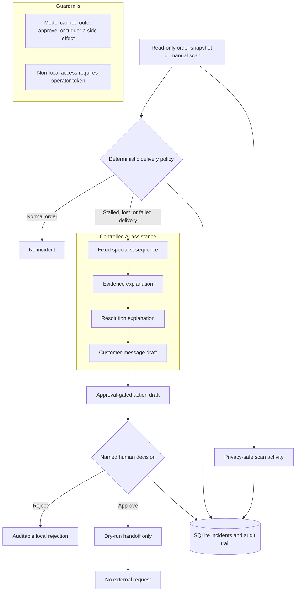

# Architecture

The diagram is intentional: the deterministic coordinator controls branching,
ordering, idempotency, and approval gates. Strands specialists may improve the
three bounded draft steps, but their output cannot choose a route or invoke an
external adapter.

## Local operator workflow

The local dashboard is served by the same FastAPI process. It reads persisted
incidents and audit records, can load synthetic demo data, and gives a named
operator exactly two choices for a pending draft: approve or reject with a
reason. Both decisions append an audit event. Neither decision sends a
customer message, changes an order, or calls a carrier.

Source `Order` data is used only during deterministic triage and is not stored
with an incident. Customer names and emails are excluded from all specialist
prompts. A deterministic boundary filter redacts common email and phone-number
patterns from specialist outputs, rejection reasons, and every operator-facing
incident or audit response.

## Access boundary

The default server binds to loopback and permits a local, presentation-friendly
operator workflow. A non-loopback bind is rejected at startup unless a
16+-character `OEC_OPERATOR_TOKEN` is configured. When enabled, all data and
mutation endpoints require a bearer token. The health endpoint and static
dashboard shell remain public so the user can supply that token; the dashboard
keeps it in memory only, never browser storage.

This deliberately protects desk access rather than impersonating a full
identity system. The approval name is still a human-entered audit declaration;
a deployed instance should be placed behind TLS and an identity-aware proxy or
SSO before it is used with non-synthetic data.

## Dry-run integration boundary

`DryRunOutboundAdapter` is the first integration-shaped component. It has no
HTTP client, credentials, or external endpoint. After named approval, it
creates a deterministic preview and appends one `dry_run_prepared` audit event.
Repeating that command is idempotent. A future real adapter must stay behind
this approval boundary and require a new explicit integration decision.

## Read-only scheduled ingestion

`JsonOrderFileSource` is the first source adapter. It reads a snapshot and
exposes only the `OrderSource.load_orders()` contract; it cannot modify the
input file. `ReadOnlyScheduledScan` passes that snapshot to the existing
deterministic coordinator and persists only approval-gated incidents. The
manual `POST /scans` API remains available if a scheduled source is unavailable.

The coordinator owns branching, ordering, idempotency, and approval gates. It
uses explicit carrier states and thresholds, rather than asking a language model
to decide what work should happen. Strands specialists add bounded value where
language is useful: evidence explanation and customer-facing draft wording.

No agent is allowed to send a message, alter an order, issue a refund, or create
a replacement. Those are future integration adapters that must require a named
operator approval and produce an audit record.

## Strands and Bedrock use

`strands_runtime.py` contains three role-specific Strands agents and an
evidence tool. The live runner is deliberately separate from the demo runner,
so the deterministic policy can be tested without a model credential. The
final proof wiring can create a native `BedrockModel` using the ambient AWS
credential chain, explicit region, and an account-enabled model ID. It calls the
roles serially in the coordinator's prescribed order and retains their drafts
with the incident record. No Bedrock agent can alter the policy route, approve a
draft, or invoke an external order, carrier, or customer action.
